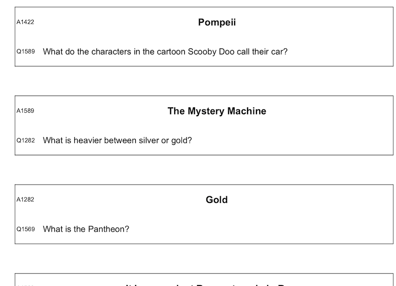

#Chain Reaction Resource Generator

## Categories
- revision
- group work
- classroom activity
- question and answer

## Summary
This resource generates Chain Reaction question cards from a set of question:answer pairs.

Each student receives one or more cards.  The cards each have an answer (displayed prominently) and a question.  The starting card's question is read, and all the students look to their own cards for the correct answer.  The student who has that answer, states it and then asks the question on that card.  The next answer is found and so forth.  If the students can't agree on the answer, the unique code next to the proposed answer may be compared to that of the question.  If correct, they will match.

A chain reaction question card set could be used as an in class activity, but also students could create their own question sets for group revision.

## Resource
The code included below is from a Google Sheets macro.  Google Sheets was used because the school involved ran GSuite and so all students and staff would have access to Google Sheets.  The school did not have a programming curriculum, so this also kept the resource accessible.

**Input via spreadsheet**


**Output ready for printing**



### Code

```
/** @OnlyCurrentDoc */

function setupToPrint() {
  var spreadsheet = SpreadsheetApp.getActive();
  var data = spreadsheet.getActiveRange();
  var questionSheet = spreadsheet.getActiveSheet();
  var printSheetName = "print" + questionSheet.getName();
  var questionOverflowLimit = 1000;

  var questionCol = "A";
  var answerCol = "B";
  var firstQuestionRow = 2;
  var lastQuestionRow = firstQuestionRow;
  var printStartRow = 1;

  var printIdCol = 1;
  var printTextCol = 2;
  var questionID = "Q";
  var answerID = "A";

  //creates a unique random id each time
  var randomIds = [];
  function randomIDGenerator(){
    var r = Math.floor(Math.random()*questionOverflowLimit);
    r = r + questionOverflowLimit;
    if(randomIds.indexOf(r) == -1){
      randomIds[randomIds.length] = r;
      return r;
    }
    else{
      return randomIDGenerator();
    }
  }

  //find number of questions
  while(lastQuestionRow < questionOverflowLimit){
      if(questionSheet.getRange(lastQuestionRow, 1).isBlank()){
        lastQuestionRow --;
        break;
      }
      lastQuestionRow++;
  }
  var numQuestions = lastQuestionRow - firstQuestionRow;
  Logger.log(numQuestions);


  //link onto new sheet
  var printRow = printStartRow + 1;
  var printSheet = spreadsheet.insertSheet(printSheetName);
  for (var q = firstQuestionRow; q<= lastQuestionRow; q++){
    //generate random ID to match the question and answer
    var id = randomIDGenerator();
    //question
    printSheet.getRange(printRow, printIdCol).setValue(questionID + id);
    printSheet.getRange(printRow, printTextCol).setValue("=\'" + questionSheet.getName() + "'\!" + questionCol + q);

    //answer
    if(q == lastQuestionRow){
      printRow = printStartRow;
    }
    else{
      printRow = printRow + 2;
    }
    printSheet.getRange(printRow, printIdCol).setValue(answerID + id);
    printSheet.getRange(printRow, printTextCol).setValue("=\'" + questionSheet.getName() + "'\!" + answerCol + q);

    printRow++;

  }

  //format for printing

  var printEndRow = printStartRow + 3 * numQuestions + 1;
  Logger.log(printEndRow);

  spreadsheet.getActiveSheet().setColumnWidth(printIdCol, 55);
  spreadsheet.getActiveSheet().setColumnWidth(printTextCol, 747);
  spreadsheet.getActiveSheet().setRowHeights(printStartRow, printEndRow, 63);

  spreadsheet.setActiveRange(printSheet.getRange(printStartRow, printIdCol, printEndRow-printStartRow + 1, printTextCol-printIdCol + 1));
  spreadsheet.getActiveRangeList().setBorder(false, false, false, false, false, false);
  spreadsheet.getActiveRangeList().setVerticalAlignment('middle').setFontSize(14);
  spreadsheet.getActiveSheet().setColumnWidth(2, 747);

  for(var i = printStartRow; i<=printEndRow; i++){
    if((i-printStartRow)%3 == 0){//answer rows
      printSheet.getRange(i, printTextCol).setFontWeight('bold').setFontSize(16).setHorizontalAlignment("center").setWrapStrategy(SpreadsheetApp.WrapStrategy.WRAP).setFontFamily("Arial");

      printSheet.getRange(i+1, printTextCol).setWrapStrategy(SpreadsheetApp.WrapStrategy.WRAP).setFontFamily("Arial");

      printSheet.getRange(i, printIdCol, 2,2).activate();
      printSheet.getActiveRangeList().setBorder(true, true, true, true, null, null, '#000000', SpreadsheetApp.BorderStyle.SOLID);
    }
  }

  spreadsheet.setActiveRange(printSheet.getRange(printStartRow, printIdCol, printEndRow-printStartRow + 1, 1));
    spreadsheet.getActiveRangeList().setFontSize(10);


};
```

### How to use this resource
1. Setup a Google Sheets document.
2. Start to record a macro (Tools| Macros), then save it and click to 'Edit.'
1. In the code editor, delete the code of your recording, and replace with the code above.
1. Back in the spreadsheet, set up a sheet where Column A is headed " Questions" and B is headed "Answers."
1. Populate this sheet with questions and answers.
1. Run the macro.  It will generate a new sheet of the same name with the prefix "Print."
1. Make any desired formatting changes to this new sheet, then print.  The default formating is designed to print in portrait on A4, with the two columns fitted to the width of one page.
1. Cut the printout so that each question/answer pair are on their own slip or card.  These must be shuffled before use (the answers have all been moved one down, so it is easy to proof read these before cutting them up, but if you hand them out to the class in order, they will be answering in order around the room.)

### Future Development
- The code should be tidied and streamlined.
- GUI options could be included for non-programming colleagues.
- Additional formatting options.
- A standalone version (not reliant on Google Sheets).
- Question sets, with filters for generating new chain reaction sets.
- Step by step guide illustrated guide for using this.
- reflections on classroom use.
- turn this into a programming task for the students - getting they invested in their own revision.